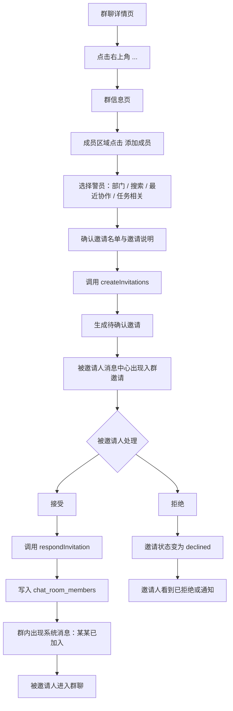

# 警务端群聊二期：成员入群与群内成员管理链路

## 二期目标

第二期重点补齐“成员如何进入群聊”和“群内成员如何被管理”的完整闭环。

本期不把群聊升级成完整 IM 系统，仍沿用第一期的 `uniCloud.callFunction + 轮询` 技术路线。二期只围绕成员链路建设：

- 群内成员邀请。
- 被邀请成员接收、拒绝入群邀请。
- 邀请状态跟踪与撤销。
- 群成员列表、角色、移除、退出。
- 成员变更审计记录。

## 核心原则

- 默认采用“邀请制”，被邀请人确认后才正式入群。
- 入群前不能读取群消息，也不能发送群消息。
- 所有成员变更必须由云函数校验权限，不能只相信前端按钮状态。
- 每次邀请、接受、拒绝、撤销、移除、退出都要落审计记录。
- 群主和群管理员可以管理成员；普通成员默认只能发起邀请申请或邀请普通成员，具体权限由后端策略控制。
- 任务群、部门群、临时群可使用不同入群策略，但第一版 UI 保持一致。

## 推荐入群策略

### 任务群

- 创建任务群时，任务负责人和当前操作警员可直接成为成员。
- 后续新增成员走邀请制。
- 群主或管理员邀请时，被邀请人接受后入群。
- 普通成员邀请时，可以直接创建邀请，也可以先进入“待管理员确认”状态；二期第一版建议先允许普通成员邀请，后端保留权限开关。

### 部门群

- 部门群创建时可自动加入同部门警员。
- 后续跨部门人员加入必须走邀请制。
- 部门群的移除、设管理员、转让群主只允许群主或管理员操作。

### 临时群

- 所有新增成员都走邀请制。
- 适合临时处置、跨部门协同、支援沟通。
- 普通成员是否可邀请，由群设置控制，默认允许邀请但不允许移除成员。

## 完整操作链路



## 发起邀请的 UI 逻辑

### 入口

在群聊详情页右上角增加 `...` 按钮，进入“群信息页”。

群信息页结构：

```text
群名称
群类型 / 关联任务 / 成员数

成员
[张三] [李四] [王五] [+]

待确认邀请 2
赵六    等待确认    [撤销]
钱七    已过期      [重新邀请]

群管理
修改群名
成员管理
退出群聊
```

### 添加成员页

点击成员区域的 `+` 后进入添加成员页。

建议支持四种选择方式：

- 部门筛选：按派出所、警种、部门选择。
- 搜索：按姓名、警号、手机号后四位搜索。
- 最近协作：展示最近同任务、同群、同预警协作过的警员。
- 任务相关：任务群中展示任务负责人、执行人、支援人员。

候选人状态要直接显示：

```text
张三  010234  湿地巡护队        已在群内
李四  010245  指挥中心          可邀请
王五  010278  森林公安          已邀请，等待确认
赵六  010299  交警协作          账号停用
```

前端交互规则：

- 已在群内的人不可勾选。
- 已有待确认邀请的人不可重复邀请，只显示“等待确认”。
- 被移除过的人允许重新邀请，但需要二次确认。
- 一次最多邀请 20 人，避免误操作。
- 确认页必须展示群名、群类型、邀请人数、邀请说明。

确认邀请页：

```text
邀请加入：湿地非法捕猎核查任务群

将邀请 3 名警员加入该群聊：
李四  指挥中心
王五  森林公安
赵六  交警协作

邀请说明：
[请协助本次任务处置，加入后可查看任务沟通内容]

[取消] [发送邀请]
```

## 被邀请成员接收入群的 UI 逻辑

### 消息中心入口

在警务端消息中心增加“入群邀请”入口。

建议放在群聊列表顶部：

```text
消息中心
[群聊] [入群邀请 2] [通知]
```

也可以在群聊列表顶部出现轻量提醒：

```text
你有 2 条入群邀请待处理      [查看]
```

### 邀请列表

```text
入群邀请

湿地非法捕猎核查任务群
邀请人：张三 010234
群类型：任务群
关联任务：T20260617
邀请说明：请协助本次任务处置
有效期至：今天 22:30
[拒绝] [接受并进入]

森林公安局-执勤协作群
邀请人：王警官 010112
群类型：部门群
有效期至：明天 09:00
[拒绝] [接受并进入]
```

### 邀请详情

点击邀请卡片进入详情页，展示：

- 群名称。
- 群类型。
- 关联任务。
- 邀请人。
- 邀请说明。
- 当前成员数。
- 邀请有效期。
- 入群后是否允许查看历史消息。

按钮：

- `接受并进入`：调用 `respondInvitation`，成功后跳转群聊详情页。
- `拒绝`：可填写拒绝原因，调用 `respondInvitation`。

接受成功后：

```text
系统消息：李四已加入群聊
```

拒绝后：

```text
邀请状态：已拒绝
邀请人可在群信息页的“待确认邀请”中看到结果。
```

## 邀请状态流转

邀请状态建议使用独立状态机。

```text
pending      待处理
accepted     已接受
declined     已拒绝
expired      已过期
cancelled    已撤销
invalid      已失效
```

状态流转规则：

- `pending -> accepted`：被邀请人接受，写入 `chat_room_members`。
- `pending -> declined`：被邀请人拒绝。
- `pending -> cancelled`：邀请人、群主或管理员撤销。
- `pending -> expired`：超过有效期后自动视为过期。
- `pending -> invalid`：群已关闭、被邀请账号停用、邀请人失去权限等异常情况。

接受邀请必须做幂等处理：

- 重复点击接受，只能生成一条成员关系。
- 如果已经是成员，直接返回成功并进入群聊。
- 如果邀请已经失效，返回明确提示。

## 群内成员管理

### 群信息页能力

群信息页二期应从简单弹窗升级为独立页面。

核心模块：

- 群基础信息：群名、群类型、关联任务、创建人、创建时间。
- 成员列表：头像、姓名、警号、部门、群角色、加入时间。
- 待确认邀请：邀请人、被邀请人、状态、过期时间、撤销/重新邀请。
- 群管理操作：修改群名、添加成员、移除成员、设置管理员、退出群聊。

### 成员列表

```text
成员管理

张三  010234  群主      湿地巡护队
李四  010245  管理员    指挥中心       [取消管理员]
王五  010278  成员      森林公安       [设为管理员] [移出群聊]
赵六  010299  成员      交警协作       [移出群聊]
```

### 成员操作

群主可操作：

- 添加成员。
- 撤销待处理邀请。
- 移除普通成员。
- 设置或取消管理员。
- 转让群主。
- 解散或关闭临时群。

管理员可操作：

- 添加成员。
- 撤销自己发出的邀请。
- 移除普通成员。

普通成员可操作：

- 查看成员列表。
- 发起邀请。
- 退出群聊。

限制：

- 不能移除群主。
- 管理员不能移除管理员。
- 普通成员不能移除任何人。
- 任务群内，如果成员是任务负责人或当前执行人，移除前必须提示“可能影响任务协作”。
- 群主退出前必须先转让群主；临时群只有一个成员时可以关闭群。

## 后端数据模型建议

### 新增 chat_room_invitations

用于保存入群邀请。

核心字段：

- `_id`
- `room_id`
- `room_name`
- `room_type`
- `task_id`
- `dept`
- `inviter_id`
- `inviter_name`
- `inviter_badge_no`
- `invitee_id`
- `invitee_name`
- `invitee_badge_no`
- `invite_reason`
- `status`
- `history_visible_from`
- `expire_time`
- `respond_time`
- `respond_reason`
- `cancelled_by`
- `cancel_reason`
- `create_time`
- `update_time`

索引建议：

- `room_id + invitee_id + status`
- `invitee_id + status + create_time`
- `room_id + status + create_time`

### 扩展 chat_room_members

建议增加字段：

- `invited_by`
- `invite_id`
- `history_visible_from`
- `removed_by`
- `removed_reason`
- `removed_at`
- `left_at`

`status` 建议从二态扩展为：

```text
active    正常成员
left      主动退出
removed   被移除
disabled  账号异常导致不可用
```

### 新增 chat_room_member_events

用于成员变更审计。

核心字段：

- `_id`
- `room_id`
- `operator_id`
- `operator_name`
- `target_id`
- `target_name`
- `event_type`
- `event_desc`
- `extra`
- `create_time`

事件类型：

- `invite_created`
- `invite_accepted`
- `invite_declined`
- `invite_cancelled`
- `invite_expired`
- `member_joined`
- `member_left`
- `member_removed`
- `role_changed`
- `owner_transferred`

## 云函数 action 建议

在 `gw-chat` 中新增或扩展以下 action：

- `getRoomMembers`：获取群成员和待确认邀请。
- `searchInviteCandidates`：搜索可邀请警员，返回已在群内、待邀请、账号异常等状态。
- `createInvitations`：批量创建入群邀请。
- `getMyInvitations`：获取当前警员待处理邀请。
- `respondInvitation`：接受或拒绝入群邀请。
- `cancelInvitation`：撤销待处理邀请。
- `removeMember`：移除群成员。
- `leaveRoom`：主动退出群聊。
- `setMemberRole`：设置或取消管理员。
- `transferOwner`：转让群主。

关键后端校验：

- 操作人必须是群成员，且具备对应权限。
- 被邀请人必须是有效警务账号。
- 被邀请人不能已经是活跃群成员。
- 同一群同一人只能存在一条有效 `pending` 邀请。
- 接受邀请时必须再次校验群是否存在、是否关闭、邀请是否过期。
- 写入成员关系和更新邀请状态要尽量保持幂等。
- 成员被移除或退出后，不允许继续读取和发送消息。

## 历史消息可见策略

邀请确认页要展示“入群后可查看的历史范围”。

建议第一版采用可配置策略：

- 任务群：默认允许查看全部历史，方便新加入人员理解任务上下文。
- 部门群：默认从入群时间开始可见。
- 临时群：默认从入群时间开始可见。

落库字段使用 `chat_room_members.history_visible_from`。

`getMessageList` 后端读取消息时要同时校验：

```text
message.create_time >= member.history_visible_from
```

如果群主在邀请时选择“允许查看历史消息”，则 `history_visible_from` 可设置为群创建时间；否则设置为接受入群时间。

## 异常与边界场景

- 网络失败：前端保留邀请按钮可重试，不重复生成邀请。
- 重复邀请：返回“已邀请，等待确认”。
- 已在群内：返回“该成员已在群内”。
- 邀请过期：被邀请人点击接受时提示“邀请已过期，请联系邀请人重新邀请”。
- 群已关闭：邀请自动失效。
- 操作人失去权限：待处理邀请可以继续存在，但接受时后端应按群策略决定是否失效。
- 被邀请账号停用：邀请失效，不能入群。
- 被移除成员重新入群：需要重新邀请，接受后生成新的加入记录，并保留历史审计。

## 二期验收标准

- 群成员能从群信息页发起成员邀请。
- 添加成员页能搜索警员，并正确展示已在群内、待确认、可邀请状态。
- 被邀请警员能在消息中心看到入群邀请。
- 被邀请警员能接受邀请并进入群聊。
- 被邀请警员能拒绝邀请，邀请人能看到拒绝状态。
- 邀请人或管理员能撤销待处理邀请。
- 接受邀请前，被邀请人不能读取该群消息。
- 接受邀请后，成员列表和群聊列表能出现该群。
- 群内出现成员加入的系统消息。
- 群主或管理员能移除普通成员。
- 被移除成员不能继续读取或发送群消息。
- 所有成员变更都有审计记录。

## 建设顺序

1. 新增邀请表、成员事件表，并扩展成员表字段。
2. 在 `gw-chat` 增加邀请相关 action。
3. 将群信息从弹窗升级为独立页面。
4. 实现成员列表、待确认邀请列表和添加成员页。
5. 在消息中心增加“入群邀请”入口。
6. 实现接受、拒绝、撤销邀请链路。
7. 实现移除成员、退出群聊、设置管理员。
8. 补充历史消息可见范围和后端权限校验。

